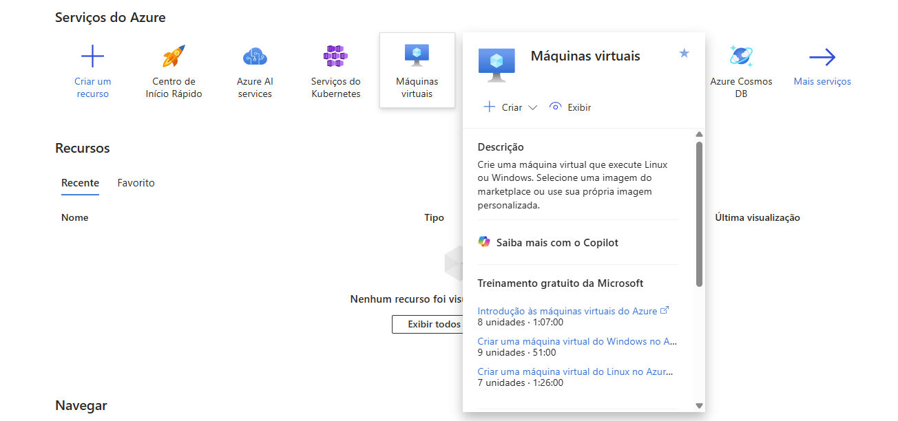

# CriarVMAzure

## Criar uma máquina virtual do Linux no Portal do Azure. 

Entrar no portal do azure.

1. [https://portal.azure.com/?quickstart=true#home](https://portal.azure.com/?quickstart=true#home)
2. Em **Serviços**, selecione **Máquinas virtuais**.

<figure><figcaption></figcaption></figure>

3. Na página **Máquinas virtuais**, clique em **Criar** e selecione **Máquina virtual do Azure**. A página **Criar uma máquina virtual** é aberta.

<figure><figcaption></figcaption></figure>

4. Em **Detalhes da instância**, insira dos dados.

* **Nome da VM**: Dê um nome descritivo (ex.: MinhaVM).
* **Região**: Escolha uma região próxima para reduzir latência (ex.: East US ou South Brazil).
* [Zonas de disponibilidade](https://learn.microsoft.com/pt-br/azure/reliability/availability-zones-overview?context=/azure/virtual-machines/context/context) expandem o nível de controle de que você precisa para manter a disponibilidade dos aplicativos e dos dados em suas VMs.
* Cada zona de disponibilidade tem uma rede, resfriamento e fonte de energia distintos. Ao arquitetar suas soluções para usar VMs replicadas em zonas, você pode proteger seus aplicativos e seus dados contra a perda de um data center. Se uma zona for comprometida, os aplicativos e os dados replicados ficarão instantaneamente disponíveis em outra zona.
* **Imagem**: Selecione o sistema operacional (ex.: Ubuntu Server 20.04 LTS ou Windows Server 2019).
* **Tamanho**: Escolha um tamanho básico, como B1s (ideal para testes e gratuito em algumas camadas).
* Nome de usuário. ex: azureuser
* Senha. ex: senha forte
* Nome do par de chaves. ex: minhaVm\_key

<figure><figcaption></figcaption></figure>

<figure><figcaption></figcaption></figure>

<figure><figcaption></figcaption></figure>

5. Clique em Revisar + criar.
6. Revise e clique em criar , **Caso tudo esteja correto**.
7. Baixar e guardar a sua chave privada.

<figure><figcaption></figcaption></figure>
